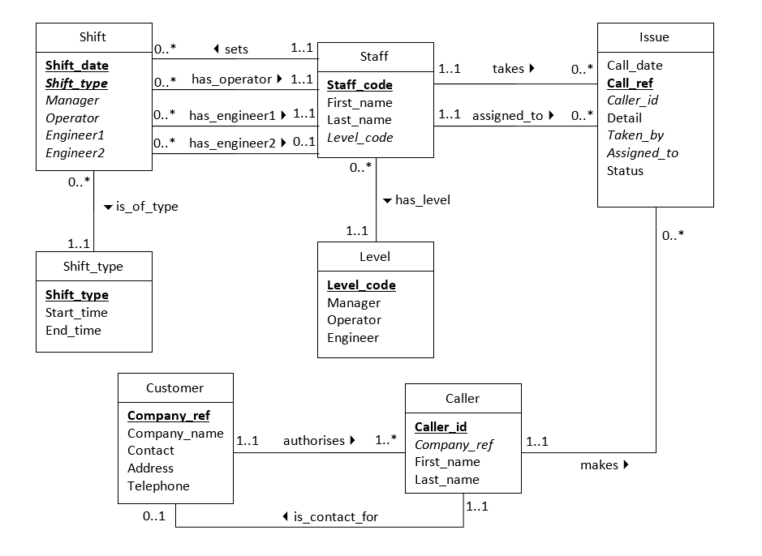

# Help Desk
Link: [Help Desk](https://sqlzoo.net/wiki/Help_Desk)    

[Jump directly to Solutions](./help-desk.md#Solutions)

---
# Setup
### ER Diagram

> *For some reason, all tables here needs to be in Title case in the queries.*       
> **Why though??**    #check        
### Issue Table
| Call_date                     | Call_ref    | Caller_id  | Detail                                                                               | Taken_by     | Assigned_to | Status  |
| ----------------------------- | ----------- | ---------- | ------------------------------------------------------------------------------------ | ------------ | ----------- | ------- |
| Sat, 12 Aug 2017 08:16:00 GMT | 1237        | 9          | How can I guarantee a digital communication in Oracle ?                              | AW1          | AE1         | Closed  |
| Sat, 12 Aug 2017 08:24:00 GMT | 1238        | 10         | How can I vanish a task-based documentation in Adobe Acrobat ?                       | AW1          | JE1         | Closed  |
| Sat, 12 Aug 2017 08:29:00 GMT | 1239        | 12         | How can I request a usability in Microsoft Powerpoint ?                              | AW1          | AE1         | Closed  |
| Sat, 12 Aug 2017 08:43:00 GMT | 1240        | 13         | How can I skip a aspect ratio in Oracle ?                                            | AW1          | JE1         | Closed  |
| Sat, 12 Aug 2017 08:48:00 GMT | 1241        | 14         | I'm trying to train a locator in SQL Server but the Information Mapping is too wacky | AW1          | AE1         | Closed  |
| Sat, 12 Aug 2017 08:49:00 GMT | 1242        | 15         | I'm trying to wobble a access key in SQL Server but the XML schema is too reflective | AW1          | AE1         | Closed  |
| Sat, 12 Aug 2017 09:01:00 GMT | 1243        | 16         | I'm trying to scatter a tacit knowledge in Adobe PhotoShop but the CSS is too tawdry | AW1          | JE1         | Closed  |
| Sat, 12 Aug 2017 09:01:00 GMT | 1244        | 17         | How can I remind a vocabulary list in Microsoft Excel ?                              | AW1          | JE1         | Open    |
| ..............                | ........... | .......... | ............                                                                         | ............ | ........... | ....... |
### Staff Table
| Staff_code | First_name | Last_name | Level_code |
| ---------- | ---------- | --------- | ---------- |
| AB1        | Anthony    | Butler    | 1          |
| AB2        | Alexis     | Butler    | 3          |
| AE1        | Ava        | Ellis     | 7          |
| AL1        | Alexander  | Lawson    | 3          |
| AW1        | Alyssa     | White     | 1          |
| BJ1        | Briony     | Jones     | 2          |
| ......     | .......    | .....     | .......    |

### Shift Table
| Shift_date                    | Shift_type | Manager    | Operator     | Engineer1   | Engineer2 |
| ----------------------------- | ---------- | ---------- | ------------ | ----------- | --------- |
| Sat, 12 Aug 2017 00:00:00 GMT | Early      | LB1        | AW1          | AE1         | JE1       |
| Sat, 12 Aug 2017 00:00:00 GMT | Late       | AE1        | IM1          | AL1         | BJ1       |
| Sun, 13 Aug 2017 00:00:00 GMT | Early      | AE1        | MM1          | MW1         |           |
| Sun, 13 Aug 2017 00:00:00 GMT | Late       | AE1        | AE1          | EB1         |           |
| ...............               | .........  | .......... | ............ | ........... | .......   |

### Shift Type Table
|Shift_type|Start_time|End_time|
|---|---|---|
|Early|08:00|14:00|
|Late|14:00|20:00|
### Customer Table
| Company_ref | Company_name       | Contact_id | Address_1          | Address_2 | Town            | Postcode     | Telephone          |
| ----------- | ------------------ | ---------- | ------------------ | --------- | --------------- | ------------ | ------------------ |
| 100         | Haunt Services     | 112        | 53 Finger Gate     |           | Dartford        | DA48 5WU     | 01001722832        |
| 101         | Genus Ltd.         | 33         | 34 Pyorrhea Green  |           | Guildford       | GY34 4ZH     | 01004256920        |
| 102         | Corps Ltd.         | 111        | 67 Napery Green    |           | Harrow          | HA32 6PP     | 01012384042        |
| 103         | Train Services     | 115        | 30 Crizzel Parkway |           | Hemel Hempstead | HP38 6DU     | 01012979358        |
| 104         | Somebody Logistics | 127        | 93 Calculated Oval |           | Hull            | HX16 1IF     | 01013707879        |
| .........   | ............       | .......... | ...........        | ........  | ...........     | ............ | .................. |
### Caller Table
| Caller_id | Company_ref | First_name | Last_name |
| --------- | ----------- | ---------- | --------- |
| 1         | 111         | Ava        | Clarke    |
| 2         | 134         | Ava        | Edwards   |
| 3         | 129         | John       | Green     |
| 4         | 108         | Ryan       | White     |
| 5         | 114         | Noah       | Evans     |
| ....      | .........   | .........  | .......   |
### Level Table
|Level_code|Manager|Operator|Engineer|
|---|---|---|---|
|1||Y||
|2|||Y|
|3||Y|Y|
|4|Y|||
|5|Y|Y||
|7|Y|Y|Y|

---
# Solutions
##  Problem 1
#easy    
 There are three issues that include the words "index" and "Oracle". Find the call_date for each of them.
```sql
select call_date, call_ref from Issue
where detail like "%Oracle%" and detail like "%index%";
```
##  Problem 2
#easy    
Samantha Hall made three calls on 2017-08-14. Show the date and time for each.
```sql
select Issue.call_date, 
	Caller.first_name, Caller.last_name 
from Caller join Issue 
	on Caller.caller_id = Issue.caller_id 
where Issue.call_date like '%2017-08-14%' 
	and first_name = 'samantha' and last_name = 'hall';
```

##  Problem 3
#easy    
There are 500 calls in the system (roughly). Write a query that shows the number that have each status.
```sql
select status, count(*) as volume
from Issue
group by status;
```

##  Problem 4
#easy    
Calls are not normally assigned to a manager but it does happen. How many calls have been assigned to staff who are at Manager Level?
```sql
select count(*) as mlcc from Issue
join Staff on Issue.assigned_to = Staff.staff_code
join Level on Staff.level_code = Level.level_code
where Level.manager = 'Y';
```


##  Problem 5
#easy    
Show the manager for each shift. Your output should include the shift date and type; also the first and last name of the manager.
```sql
select Shift.shift_date, Shift.shift_type,
	Staff.first_name, Staff.last_name
from Shift join Staff
	on Shift.manager = Staff.staff_code
order by Shift.shift_date;
```

##  Problem 6
#medium    
List the Company name and the number of calls for those companies with more than 18 calls.
```sql
select Customer.company_name, 
	count(call_ref) as cc from Customer
join Caller on Customer.company_ref = Caller.company_ref
join Issue on Caller.caller_id = Issue.caller_id
group by Customer.company_name
having cc > 18
order by Customer.company_name;
```

##  Problem 7
#medium     
Find the callers who have never made a call. Show first name and last name
```sql
select first_name, last_name from Caller
where caller_id not in (
	select Issue.caller_id from Issue 
	join Caller on Caller.caller_id = Issue.caller_id
);
```

##  Problem 8
#medium      
For each customer show: Company name, contact name, number of calls where the number of calls is fewer than 5
```sql
with tmp as(
	select Customer.company_name, Customer.contact_id,
		count(*) as nc from Customer 
	join Caller on Caller.company_ref = Customer.company_ref
	join Issue on Issue.caller_id = Caller.caller_id
	group by Customer.company_name, Customer.contact_id
	having count(*) <5
)

select tmp.company_name, Caller.first_name, 
	Caller.last_name, tmp.nc from tmp
join Caller on tmp.contact_id = Caller.caller_id
order by tmp.company_name;
```

##  Problem 9
#medium     
For each shift show the number of staff assigned. Beware that some roles may be NULL and that the same person might have been assigned to multiple roles (The roles are 'Manager', 'Operator', 'Engineer1', 'Engineer2').
```sql
with tmp as (
	select shift_date, shift_type, manager as job 
	from Shift
union all
	select shift_date, shift_type, operator as job 
	from Shift
union all
	select shift_date, shift_type, engineer1 as job 
	from Shift
union all
	select shift_date, shift_type, engineer2 as job 
	from Shift
) 

select shift_date, shift_type, 
	count(distinct job) as cw from tmp
group by shift_date,shift_type;
```

> My idea of using `case` statement to individually separate each job would not work because each person can be assigned to multiple jobs.
##  Problem 10
#medium    
Caller 'Harry' claims that the operator who took his most recent call was abusive and insulting. Find out who took the call (full name) and when.
```sql
select Staff.first_name, Staff.last_name, Issue.call_date from Staff 
join Issue on Issue.taken_by = Staff.staff_code
join Caller on Caller.caller_id = Issue.caller_id
where Caller.first_name = "Harry"
order by Issue.call_date desc
limit 1;
```

##  Problem 11
#hard      
Show the manager and number of calls received for each hour of the day on 2017-08-12.
```sql
with tmp as(
	select 
		date_format(call_date, '%Y-%m-%d %H') as date_hour, 
		date_format(call_date, '%Y-%m-%d') as date, 
		date_format(call_date, '%H') as hour
	from Issue
	where date_format(Issue.call_date, '%Y-%m-%d') = '2017-08-12'
)

select Shift.manager, tmp.date_hour as Hr, 
	count(*) as cc from tmp
join Shift on tmp.date = Shift.shift_date
where 
	Shift.shift_type = 'early' and tmp.hour < 14 
	or Shift.shift_type = 'late' and tmp.hour >= 14
group by Shift.manager, tmp.date_hour
order by tmp.date_hour;
```

##  Problem 12
#hard      
80/20 rule. It is said that 80% of the calls are generated by 20% of the callers. Is this true? What percentage of calls are generated by the most active 20% of callers.       
Note - Andrew has not managed to do this in one query - but he believes it is possible.       
```sql
select 
	round(
		sum(p2.cc/(select count(*) from Issue)
	) * 100, 4) as t20pc
from (
	select p1.*,@counter := @counter + 1 as counter
	from (select @counter := 0) as initvar,	
		(
		select	caller_id, count(*) as cc from Issue
		group by caller_id
		order by count(*) desc
		) as p1
) as p2
where counter <= (20 / 100 * @counter);
```

##  Problem 13
#hard    
Annoying customers. Customers who call in the last five minutes of a shift are annoying. Find the most active customer who has never been annoying.
```sql
with Annoying as(
	select Customer.company_name
	from Customer 
	join Caller on Caller.company_ref = Customer.company_ref
	join Issue on Issue.caller_id = Caller.caller_id
	where date_format(Issue.call_date, '%H:%i') 
		between '13:55' and '14:00'
	or date_format(Issue.call_date, '%H:%i') 
		between '19:55' and '20:00'
)

select Customer.company_name , count(*) as abna from Issue 
join Caller on Caller.caller_id = Issue.caller_id 
join Customer on Customer.company_ref = Caller.company_ref 
where Customer.company_name not in (select * from Annoying)
group by Customer.company_name
order by count(*) desc
limit 1;

```

##  Problem 14
#hard     
Maximal usage. If every caller registered with a customer makes a call in one day then that customer has "maximal usage" of the service. List the maximal customers for 2017-08-13.
```sql
with c_issue as(
	select Customer.company_name, 
		count(*) as issue_count
	from Customer join Caller 
		on Caller.company_ref = Customer.company_ref
	group by Customer.company_name
),
c_caller as(
	select Customer.company_name,
		count(distinct(Caller.caller_id)) as caller_count
	from Issue join Caller 
		on Caller.caller_id = Issue.caller_id
	join Customer on Customer.company_ref = Caller.company_ref
	where date_format(call_date, '%Y-%m-%d') = '2017-08-13'
	group by Customer.company_name
)

select c_issue.company_name, 
	c_caller.caller_count, c_issue.issue_count
from c_issue
join c_caller
	on c_issue.issue_count = c_caller.caller_count 
		and c_issue.company_name = c_caller.company_name
order by c_issue.company_name;
```

##  Problem 15
#hard     
Consecutive calls occur when an operator deals with two callers within 10 minutes. Find the longest sequence of consecutive calls – give the name of the operator and the first and last call date in the sequence.
```sql
with cons_call as(
	select Issue.taken_by, Issue.call_date,
		@counter := case 
			when timestampdiff(
				minute, @current_call, Issue.call_date
			) <= 10 then @counter + 1
			else 1
	    end as call_count,
	    @first_call := case 
			when @counter = 1 then @first_call := call_date
			else @first_call
        end as first_call,
       @current_call := Issue.call_date
	from Issue, (
		select @counter := 0, 
				@first_call := 0, 
				@current_call := 0) as initvar
		order by Issue.taken_by, Issue.call_date
) 

select taken_by, first_call, 
	call_date as last_call, 
	call_count as calls
from cons_call
order by call_count desc
limit 1;
```
